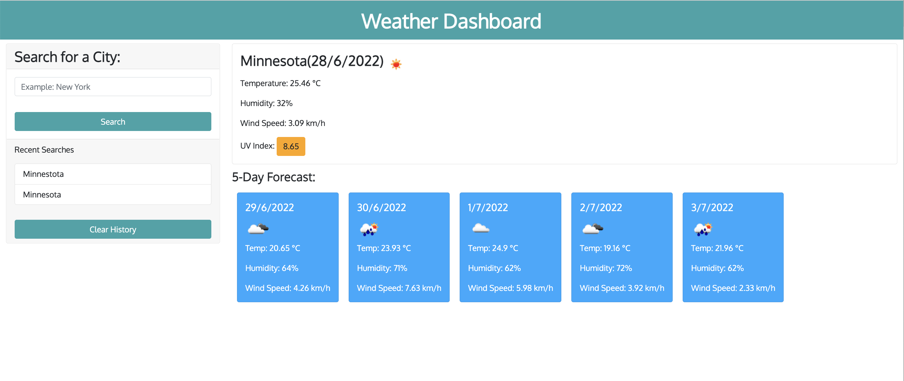

# Weather Dashboard Report

## Description

> A Weather-Dashboard application to find weather conditions of a given city with both the current and 5-Day forecast showing. The server-side API used to get response data object is retrieved from the Open Weather APi. The returned weather data includes the following weather characters and date.

* City, Date, Icon-image
* Temperature
* Humidity
* Wind Speed
* UV index

> Previous searched cities remain on the page so that you can view them again.  

## User Storey 
```md
AS A traveler
I WANT to see the weather outlook for multiple cities
SO THAT I can plan a trip accordingly
```

## Example

The following image shows the web application's appearance and functionality:



## Installation

> This website doesnt require installation of any programs or software. It can be viewed on any web browser. It is now live at the following URL https://marissakrantz.github.io/weather-report/. 

## Built With

> [Visual Studio Code](https://code.visualstudio.com/)

## Acknowledgements

* [GitHub Pages](https://pages.github.com)
* [W3 Schools](https://www.w3schools.com/)
* [MDN Web Docs](https://developer.mozilla.org/en-US/)
* [Open Weather API](https://openweathermap.org/api/one-call-api)
* [MomentJs](https://momentjs.com/)
* [Google Fonts](https://fonts.google.com/)
* [Bootsrap](https://getbootstrap.com/)
* [JQuery](https://jquery.com/)

## Author

> Marissa Tobin - [https://github.com/marissakrantz](https://github.com/marissakrantz)

## Project Status

> Website is currently live. 